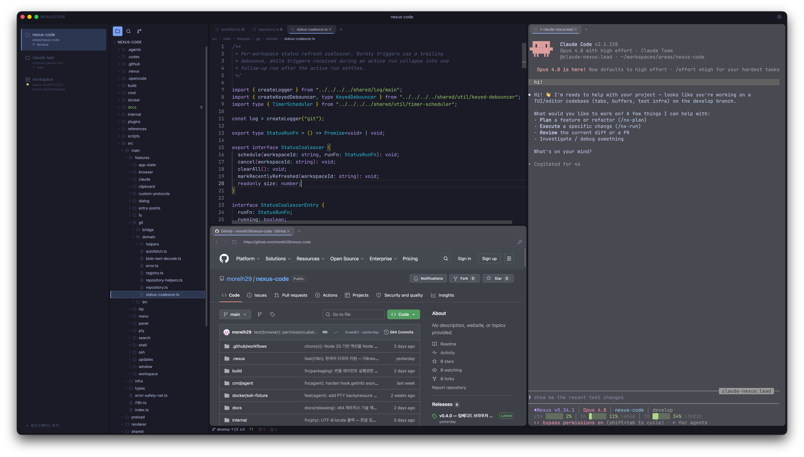
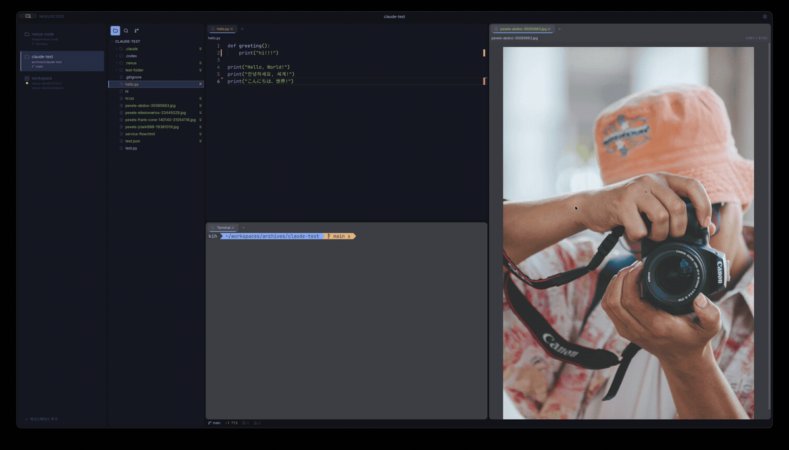

<div align="center">

# NexusCode

**한 창에서 여러 워크스페이스를.** macOS 용 VSCode-style 에디터 — Monaco 에디터와 통합 터미널을 하나의 창에 담았습니다.

[](https://github.com/moreih29/nexus-code/releases)
[](https://github.com/moreih29/nexus-code/releases)
[](LICENSE)




</div>

## 왜 NexusCode 인가

VSCode 로 여러 프로젝트를 동시에 다루려면 창을 여러 개 띄워야 합니다. NexusCode 는 **하나의 창 안에 여러 워크스페이스**를 담습니다. 각 워크스페이스는 자기만의 파일 트리 · 에디터 그룹 · 터미널을 가지며, 단축키 하나로 즉시 전환됩니다. 로컬 폴더든 SSH 원격 호스트든 같은 방식으로 다룹니다.

VSCode 가 주는 IDE 경험은 그대로, 멀티 워크스페이스는 VSCode 가 못 주는 방식으로.

## ✨ 주요 기능

<div align="center">
  
</div>

- **멀티 워크스페이스** — 한 창에서 여러 워크스페이스를 두고 `⌘⌃↑` · `⌘⌃↓` 로 전환. 각자 독립된 파일 트리 · 탭 · 터미널.
- **분할 그룹** — 에디터를 좌우(`⌘\`) · 상하(`⌘⇧\`)로 분할하고 그룹 간 포커스 이동.
- **Monaco 에디터 + 통합 터미널** — VSCode 와 동일한 Monaco 에디터, xterm 기반 터미널을 한 화면에.
- **SSH 원격 워크스페이스** — 원격 호스트의 폴더를 로컬처럼 편집. ([가이드](docs/ssh-remote-workspace.md))
- **VSCode 호환 단축키** — 익숙한 키 매핑 그대로.

## 요구사항

- macOS 14 (Sonoma) 이상
- Apple Silicon (M1 / M2 / M3 / M4)

> 배포는 Apple Silicon (arm64) 빌드만 제공합니다. Intel (x64) 머신은 소스 빌드로 사용 가능 — [docs/INSTALL.md#self-build](docs/INSTALL.md) 참고.

## 📦 설치

[Releases 페이지](https://github.com/moreih29/nexus-code/releases)에서 최신 `.dmg` 를 내려받습니다.

| Mac | 파일 |
|---|---|
| Apple Silicon | `NexusCode-X.Y.Z-arm64.dmg` |

`.dmg` 를 마운트하고 **NexusCode** 를 `/Applications` 로 드래그한 뒤, 첫 실행 전에 아래 **보안 해제**를 거칩니다.

### 보안 해제 (Gatekeeper)

NexusCode 는 Apple 코드 사이닝 / 공증(notarization) 없이 배포됩니다. 첫 실행 시 macOS 가 앱을 차단하거나 "손상된 앱" 으로 표시하는 것은 정상입니다. 터미널에서 quarantine 속성을 제거하면 이후 더블클릭으로 바로 열립니다:

```bash
xattr -dr com.apple.quarantine "/Applications/NexusCode.app"
```

<details>
<summary>터미널 대신 GUI 로 해제하기</summary>

**macOS 14 (Sonoma)**

1. Finder 에서 `/Applications/NexusCode.app` 우클릭 (또는 Control+클릭)
2. **열기** 선택
3. "이 앱을 열 수 없습니다" 다이얼로그에서 **열기** 클릭

**macOS 15 (Sequoia) 이상**

1. 앱을 더블클릭 → 차단 알림 확인
2. **시스템 설정 → 개인정보 보호 및 보안** 으로 이동
3. 하단 "NexusCode 차단됨" 항목 옆 **그래도 열기** 클릭
4. 확인 다이얼로그에서 **열기**

자세한 단계는 [docs/INSTALL.md](docs/INSTALL.md) 참고.

</details>

## ⌨️ 단축키

VSCode 호환 매핑입니다. 자주 쓰는 것만 추렸고, 전체 목록은 **[docs/SHORTCUTS.md](docs/SHORTCUTS.md)** 에 있습니다.

| 동작 | 단축키 |
|---|---|
| 저장 | `⌘S` |
| 새 터미널 | `⌘T` |
| 우측 / 아래로 분할 | `⌘\` · `⌘⇧\` |
| 이전 / 다음 워크스페이스 | `⌘⌃↑` · `⌘⌃↓` |
| 워크스페이스 추가 | `⌘⇧N` |
| 심볼 검색 | `⌘⇧O` |
| Files 패널 토글 | `⌘B` |
| 설정 | `⌘,` |

> `⌘` 단독 단축키만 앱이 가로채며, `⌃` 단독은 터미널로 그대로 전달됩니다 — `Ctrl+R`(reverse-i-search), `Ctrl+W`(delete-word) 같은 셸 단축키가 정상 동작합니다.

## 🔄 업데이트 채널

| 채널 | 설명 |
|---|---|
| **Stable** | 권장. 정식 릴리스만 수신. |
| **Beta** | 옵트인. 프리릴리스 포함. 일부 거친 부분이 있을 수 있음. |

**설정 → Updates → Update Channel** 에서 전환합니다.

## 🛠️ 자체 빌드 / 개발

빌드 요구사항, 명령 시퀀스, 산출물 위치는 [docs/INSTALL.md#self-build](docs/INSTALL.md) 에 정리되어 있습니다.

## 📄 라이선스

[MIT](LICENSE) © moreih29
