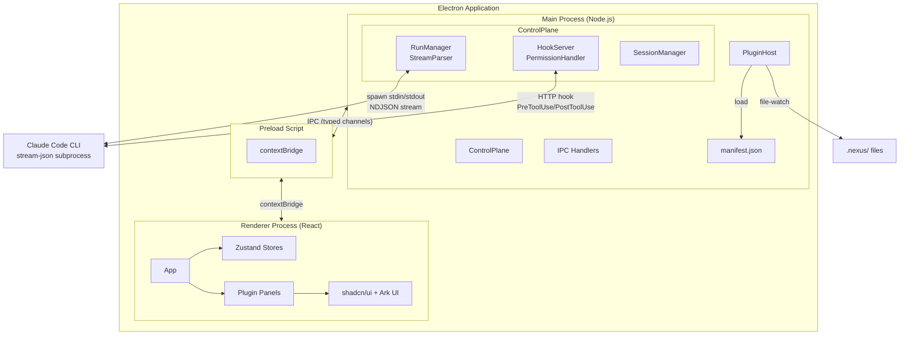
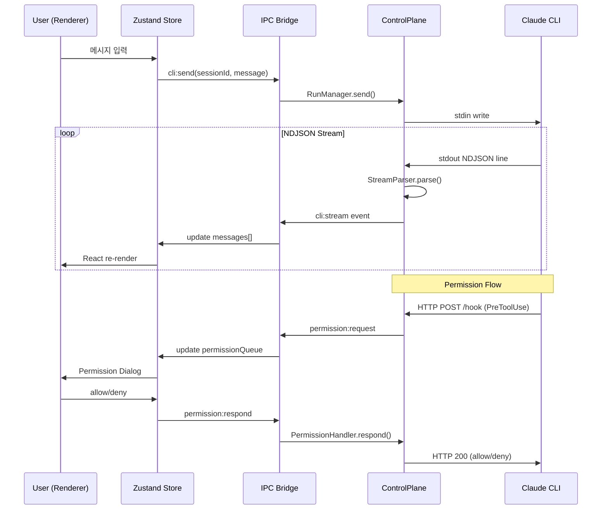

# Nexus Code - Project Roadmap

> Claude Code CLI를 GUI로 래핑하는 Electron 데스크톱 애플리케이션

---

## 1. 프로젝트 개요

### 왜 만드는가

Claude Code는 강력한 CLI 기반 AI 코딩 도구이지만, 공식 데스크톱 앱과 VS Code 확장은 커스텀 패널 추가가 불가능하거나 비효율적이다. 특히 Nexus 에이전트 오케스트레이션의 상태(consult, decisions, tasks)를 시각화하고, 마크다운 뷰어, 에이전트 활동 타임라인 등 자유로운 레이아웃을 구현하려면 독립 앱이 필요하다.

### 무엇을 만드는가

Claude Code CLI(`claude -p --output-format stream-json`)를 subprocess로 실행하여 NDJSON 스트림을 파싱하고, HTTP 훅 서버로 퍼미션을 인터셉트하는 Electron 데스크톱 앱. 플러그인 기반 아키텍처로 Nexus를 첫 구현체로 하되, 향후 브라우저 패널, Git 패널 등으로 확장 가능한 구조를 갖춘다.

---

## 2. 기술 결정 기록

### D1: 독립 데스크톱 앱 vs 공식 도구 확장

| 선택지 | 장점 | 단점 |
|--------|------|------|
| 공식 Desktop App 확장 | 기존 UX 활용 | 커스텀 패널 추가 불가, 폐쇄적 구조 |
| VS Code Extension | 에디터 통합 | 커스텀 레이아웃 제한, webview API 제약 |
| **독립 데스크톱 앱** | **자유 레이아웃, 완전한 제어** | **전체 UI 직접 구현 필요** |

**결정: 독립 데스크톱 앱.** clui-cc 방식의 CLI stream-json 래핑으로, Nexus 상태 시각화, 마크다운 뷰어, 브라우저 패널 등 자유 레이아웃을 구현한다.

### D2: Electron vs Tauri vs Electrobun

| 선택지 | 장점 | 단점 |
|--------|------|------|
| Tauri v2 | 경량 바이너리, Rust 백엔드 | macOS에서 OS WebView(WebKit) 사용 - Chrome 렌더링 차이 발생 |
| Electrobun | 경량, 최신 | 미성숙한 생태계, WebKit 기반 동일 문제 |
| **Electron v39+** | **Chromium 일관성, 거대 생태계** | **바이너리 크기, 메모리 사용량** |

**결정: Electron (v39+).** Tauri/Electrobun은 macOS에서 WebKit 기반 OS WebView를 사용하여 Chrome 렌더링 차이 문제가 재발한다. Electron은 macOS 26 호환성 이슈가 v36.9.2+에서 해결 완료. 투명 오버레이 없이 일반 윈도우로 구현하여 안정성을 확보한다.

### D3: CLI 통신 방식 - stream-json + HTTP Hook vs PTY vs Agent SDK

| 선택지 | 장점 | 단점 |
|--------|------|------|
| PTY (pseudo-terminal) | 터미널 출력 그대로 | ANSI 파싱 불안정, 구조화된 데이터 추출 어려움 |
| Agent SDK | 공식 API, 타입 안전 | API 키 필수 - 구독 인증 기반 사용 불가 |
| **stream-json + HTTP Hook** | **구조화된 NDJSON, 퍼미션 인터셉트** | **CLI 버전 의존성** |

**결정: stream-json subprocess + HTTP 훅 서버.** `claude -p --output-format stream-json`으로 NDJSON 스트림 수신, HTTP 훅 서버(PreToolUse)로 퍼미션 인터셉트. PTY는 파싱 불안정으로 제외, Agent SDK는 API 키 필수라 구독 인증 기반 사용 목적에 부적합하다.

### D4: 릴리스 로드맵

MVP에서 핵심 기능을 검증하고, 단계적으로 기능을 확장한다. 상세 범위는 [섹션 5](#5-릴리스-계획) 참조.

### D5: PluginHost 프로토콜 기반 아키텍처

| 선택지 | 장점 | 단점 |
|--------|------|------|
| 하드코딩 후 리팩토링 | 빠른 초기 개발 | 리팩토링 비용, 기술 부채 |
| **MVP부터 플러그인 프로토콜** | **확장성 내장, 일관된 구조** | **초기 설계 비용** |

**결정: MVP부터 PluginHost 프로토콜.** manifest.json으로 패널 선언, file-watch/HTTP/hook-events 데이터 소스, tree/timeline/table 등 렌더러 지원. Nexus가 첫 구현체이며, 하드코딩 후 리팩토링 대신 처음부터 확장 가능한 구조를 채택한다.

### D6: 패키지 매니저 및 UI 라이브러리

| 항목 | 결정 | 근거 |
|------|------|------|
| 패키지 매니저 | Bun | 빠른 설치 속도, 런타임은 Electron(Node.js) 유지 |
| 메인 UI | shadcn/ui | 커스터마이즈 가능, Tailwind 기반, 컴포넌트 소유 |
| 보조 UI | Ark UI | Tree 등 shadcn에 없는 컴포넌트 보완 |
| 디자인 참고 | Origin UI | 디자인 변형 레퍼런스 |
| 디자인 방향 | 미니멀 클린 | 정보 밀도와 가독성 균형 |

---

## 3. 아키텍처 설계

### 전체 구조도



### ControlPlane

Main Process의 핵심 모듈. CLI와의 모든 통신을 관장한다.

| 컴포넌트 | 역할 |
|----------|------|
| **RunManager** | `claude -p --output-format stream-json` subprocess spawn, NDJSON 스트림 파싱, 메시지 타입별 분류 |
| **StreamParser** | RunManager 내부 모듈. NDJSON 라인 파싱, assistant/tool_use/result 등 메시지 타입 처리 |
| **HookServer** | 로컬 HTTP 서버 기동. PreToolUse/PostToolUse 이벤트 수신, 퍼미션 요청을 Renderer에 전달 |
| **PermissionHandler** | HookServer의 퍼미션 요청을 UI와 연동. allow/deny 응답을 HTTP response로 반환 |
| **SessionManager** | 세션 생성/저장/복원. 히스토리 관리, 세션별 CLI 인스턴스 매핑 |

### PluginHost 프로토콜

범용 플러그인 패널 시스템. `manifest.json`으로 패널을 선언하고, 데이터 소스와 렌더러를 연결한다.

**manifest.json 구조:**
```json
{
  "id": "nexus",
  "name": "Nexus Panel",
  "version": "1.0.0",
  "panels": [
    {
      "id": "nexus-state",
      "title": "Nexus State",
      "dataSource": {
        "type": "file-watch",
        "paths": [".nexus/"]
      },
      "renderer": "tree"
    }
  ]
}
```

**데이터 소스 타입:**
- `file-watch`: 파일 시스템 변경 감시 (Nexus .nexus/ 파일)
- `http`: HTTP 엔드포인트 폴링/SSE
- `hook-events`: HookServer의 PreToolUse/PostToolUse 이벤트 스트림

**렌더러 타입:**
- `tree`: 트리 뷰 (decisions, tasks 구조)
- `timeline`: 타임라인 (에이전트 활동)
- `table`: 테이블 (세션 히스토리)
- `markdown`: 마크다운 렌더링

### IPC 설계

Main-Renderer 간 통신은 타입 안전 채널(`shared/types.ts`)로 설계한다.

```typescript
// shared/types.ts - IPC 채널 타입 정의
type IpcChannels = {
  // Session
  'session:create': () => SessionId;
  'session:list': () => Session[];
  'session:load': (id: SessionId) => Session;

  // CLI
  'cli:send': (sessionId: SessionId, message: string) => void;
  'cli:stream': (callback: (event: StreamEvent) => void) => void;

  // Permission
  'permission:request': (callback: (req: PermissionRequest) => void) => void;
  'permission:respond': (requestId: string, allow: boolean) => void;

  // Plugin
  'plugin:data': (pluginId: string, callback: (data: unknown) => void) => void;
};
```

### 데이터 흐름



### 디렉토리 구조

```
nexus-code/
├── src/
│   ├── main/                        # Electron Main Process
│   │   ├── index.ts                 # 앱 진입점, BrowserWindow 생성
│   │   ├── control-plane/           # ControlPlane
│   │   │   ├── run-manager.ts       # CLI spawn, stream-json 파싱
│   │   │   ├── stream-parser.ts     # NDJSON 스트림 파서
│   │   │   ├── hook-server.ts       # HTTP 훅 서버
│   │   │   ├── permission-handler.ts # 퍼미션 요청/응답
│   │   │   └── session-manager.ts   # 세션 관리
│   │   ├── plugin-host/             # PluginHost
│   │   │   ├── index.ts             # 플러그인 로더/관리자
│   │   │   └── loader.ts            # manifest.json 파서
│   │   └── ipc/                     # IPC 핸들러 등록
│   │       └── handlers.ts
│   ├── preload/                     # Preload Scripts
│   │   └── index.ts                 # contextBridge API 노출
│   ├── renderer/                    # Renderer (React)
│   │   ├── index.html               # HTML 진입점
│   │   └── src/
│   │       ├── main.tsx             # React 진입점
│   │       ├── App.tsx              # 루트 컴포넌트
│   │       ├── app.css              # Tailwind v4 + shadcn 테마
│   │       ├── components/          # 공통 UI 컴포넌트
│   │       │   └── ui/              # shadcn 컴포넌트 (자동 생성)
│   │       ├── stores/              # Zustand 상태 관리
│   │       │   ├── session.ts       # 세션 상태
│   │       │   ├── nexus.ts         # Nexus 패널 상태
│   │       │   └── agents.ts        # 에이전트 활동 상태
│   │       ├── hooks/               # React 커스텀 훅
│   │       ├── lib/                 # 유틸리티
│   │       │   └── utils.ts         # cn() 등 shadcn 유틸
│   │       └── panels/              # 플러그인 패널 UI
│   │           └── nexus/           # Nexus 패널 구현
│   └── shared/                      # Main/Renderer 공유 타입
│       └── types.ts                 # IPC 채널 타입, 메시지 타입
├── plugins/                         # 플러그인 매니페스트
│   └── nexus/
│       └── manifest.json
├── electron.vite.config.ts          # electron-vite 빌드 설정
├── tsconfig.json                    # TypeScript 기본 설정
├── tsconfig.node.json               # Main/Preload TS 설정
├── tsconfig.web.json                # Renderer TS 설정
├── components.json                  # shadcn/ui 설정
├── package.json
└── docs/
    └── ROADMAP.md
```

---

## 4. 기술 스택

### 버전 매트릭스

> 2026-03-26 기준. 호환성 검증 완료.

| 패키지 | 버전 | 역할 | 비고 |
|--------|------|------|------|
| electron | ^41.0.0 | 데스크톱 런타임 | D2 (v39+) 충족 |
| electron-vite | ^5.0.0 | 빌드 도구 | peerDep: vite ^5/^6/^7 |
| vite | ^7.3.0 | 번들러 | electron-vite 최상위 호환 (v8 미지원) |
| @vitejs/plugin-react-swc | ^4.3.0 | React 변환 | SWC 기반, Babel 불필요 |
| @swc/core | ^1.15.0 | JS/TS 컴파일러 | electron-vite peerDep |
| react | ^19.2.0 | UI 프레임워크 | |
| react-dom | ^19.2.0 | DOM 렌더링 | |
| typescript | ~5.9.3 | 타입 시스템 | 6.0은 초기 단계, 5.x 안정판 사용 |
| tailwindcss | ^4.2.0 | CSS 프레임워크 | v4 CSS-first, config 파일 불필요 |
| @tailwindcss/vite | ^4.2.0 | Tailwind Vite 플러그인 | |
| zustand | ^5.0.0 | 상태 관리 | 경량, 보일러플레이트 최소 |
| lucide-react | ^1.7.0 | 아이콘 | shadcn 기본 아이콘 라이브러리 |
| @ark-ui/react | ^5.34.0 | 보조 UI | Tree 등 shadcn 미지원 컴포넌트 |
| shadcn (CLI) | ^4.1.0 | 컴포넌트 생성 도구 | `npx shadcn add` |
| electron-builder | ^26.8.0 | 앱 패키징/배포 | |

### Vite 호환성 주의사항

- **electron-vite 5.0.0**의 peerDep: `vite ^5.0.0 || ^6.0.0 || ^7.0.0`
- npm latest `vite`는 8.0.3이지만 electron-vite가 미지원 -- **vite@7.x로 고정**
- `@vitejs/plugin-react@6.x`는 Vite 8 전용 -- **plugin-react-swc@4.3.0** 사용 (Vite 4~8 호환)
- `@tailwindcss/vite`는 Vite 5~8 모두 지원 -- 문제없음

### 런타임/빌드

- **Bun**: 패키지 관리 전용 (`bun install`, `bun add`). 런타임은 Electron(Node.js).
- **electron-vite**: Main/Preload/Renderer 3분할 빌드. SWC 변환 + HMR 지원.
- **electron-builder**: 프로덕션 패키징 (macOS .dmg, Windows .exe, Linux .AppImage).

### 프론트엔드

- **React 19**: Concurrent 렌더링, use() 훅, Server Components 패턴 (Electron에서는 클라이언트 전용).
- **Tailwind CSS v4**: CSS-first 설정. `@import "tailwindcss";` 만으로 동작, `tailwind.config.js` 불필요.
- **shadcn/ui**: 컴포넌트 소유 모델. `npx shadcn add button` 형태로 프로젝트에 직접 복사.

### 상태 관리

- **Zustand**: sessions(세션 목록/현재 세션), nexusState(Nexus 패널 데이터), agents(에이전트 활동) 3개 스토어.
- IPC 이벤트 → Zustand 스토어 업데이트 → React 리렌더링.

### CLI 통신

- **Subprocess**: `claude -p --output-format stream-json` spawn. stdin으로 메시지 전송, stdout에서 NDJSON 수신.
- **HTTP Hook**: 로컬 HTTP 서버로 PreToolUse/PostToolUse 이벤트 인터셉트. 퍼미션 승인/거부 응답.

---

## 5. 릴리스 계획

### MVP (v1)

핵심 채팅 기능과 Nexus 통합의 기본 동작을 검증한다.

| 기능 | 설명 |
|------|------|
| 채팅 UI | stream-json 기반 실시간 메시지 스트리밍 |
| 퍼미션 UI | HTTP 훅 기반 tool use 승인/거부 다이얼로그 |
| 세션 히스토리 | 세션 생성/목록/전환/복원 |
| Nexus 상태 패널 | consult/decisions/tasks 트리 뷰 |
| 마크다운 뷰어 | 메시지 내 마크다운/코드블록 렌더링 |
| 에이전트 타임라인 | PreToolUse/PostToolUse 이벤트 기반 에이전트별 활동 표시 |

### v2

사용성 확장과 멀티태스킹 지원.

| 기능 | 설명 |
|------|------|
| 브라우저 패널 | 내장 웹뷰 (문서 참조 등) |
| 완료 알림 | 시스템 알림 (작업 완료/에러 시) |
| 멀티탭 | 여러 세션 동시 작업 |
| 파일 트리 | 프로젝트 파일 구조 탐색 |

### v3

원격 에이전트와 비용 추적.

| 기능 | 설명 |
|------|------|
| 원격 에이전트 | 경량 데몬 + WebSocket으로 원격 CLI 연결 |
| 파일 첨부 | 채팅에 이미지/파일 드래그앤드롭 |
| 비용 추적 대시보드 | 5h/7d rate limit 모니터링 + API 토큰 비용 표시 (구독제/API 키 모두 지원) |

### v4

고급 커스터마이징과 워크플로우 자동화.

| 기능 | 설명 |
|------|------|
| 레이아웃 커스텀 | 드래그 앤 드롭 패널 배치 |
| 프롬프트 템플릿 | 재사용 가능한 프롬프트 저장/관리 |
| Git 패널 | 브랜치/커밋/diff 시각화 |
| 음성 입력 | STT 기반 음성 메시지 전송 |
