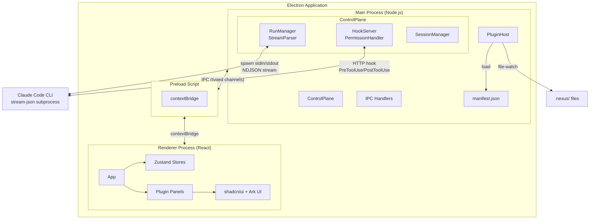
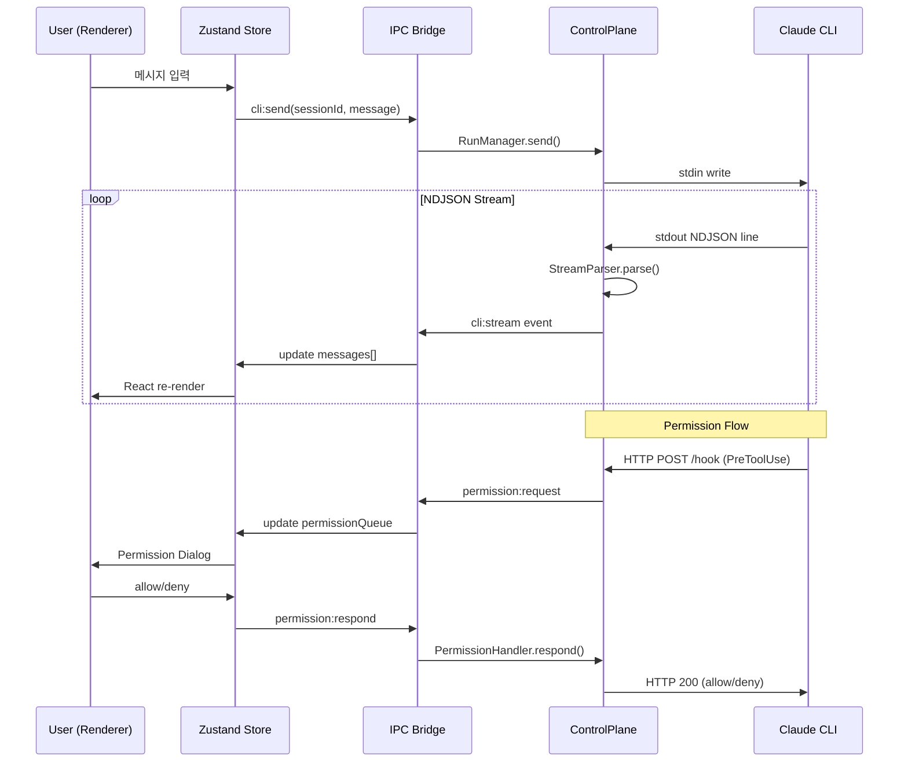

# Nexus Code - Project Roadmap

> Claude Code CLI를 GUI로 래핑하는 Electron 데스크톱 애플리케이션

---

## 1. 프로젝트 개요

### 왜 만드는가

Claude Code는 강력한 CLI 기반 AI 코딩 도구이지만, 공식 데스크톱 앱과 VS Code 확장은 커스텀 패널 추가가 불가능하거나 비효율적이다. 특히 Nexus 에이전트 오케스트레이션의 상태(consult, decisions, tasks)를 시각화하고, 마크다운 뷰어, 에이전트 활동 타임라인 등 자유로운 레이아웃을 구현하려면 독립 앱이 필요하다.

### 무엇을 만드는가

Claude Code CLI(`claude -p --output-format stream-json`)를 subprocess로 실행하여 NDJSON 스트림을 파싱하고, HTTP 훅 서버로 퍼미션을 인터셉트하는 Electron 데스크톱 앱. 플러그인 기반 아키텍처로 Nexus를 첫 구현체로 하되, 향후 브라우저 패널, Git 패널 등으로 확장 가능한 구조를 갖춘다.

---

## 2. 기술 결정 기록

### D1: 독립 데스크톱 앱 vs 공식 도구 확장

| 선택지 | 장점 | 단점 |
|--------|------|------|
| 공식 Desktop App 확장 | 기존 UX 활용 | 커스텀 패널 추가 불가, 폐쇄적 구조 |
| VS Code Extension | 에디터 통합 | 커스텀 레이아웃 제한, webview API 제약 |
| **독립 데스크톱 앱** | **자유 레이아웃, 완전한 제어** | **전체 UI 직접 구현 필요** |

**결정: 독립 데스크톱 앱.** clui-cc 방식의 CLI stream-json 래핑으로, Nexus 상태 시각화, 마크다운 뷰어, 브라우저 패널 등 자유 레이아웃을 구현한다.

### D2: Electron vs Tauri vs Electrobun

| 선택지 | 장점 | 단점 |
|--------|------|------|
| Tauri v2 | 경량 바이너리, Rust 백엔드 | macOS에서 OS WebView(WebKit) 사용 - Chrome 렌더링 차이 발생 |
| Electrobun | 경량, 최신 | 미성숙한 생태계, WebKit 기반 동일 문제 |
| **Electron v39+** | **Chromium 일관성, 거대 생태계** | **바이너리 크기, 메모리 사용량** |

**결정: Electron (v39+).** Tauri/Electrobun은 macOS에서 WebKit 기반 OS WebView를 사용하여 Chrome 렌더링 차이 문제가 재발한다. Electron은 macOS 26 호환성 이슈가 v36.9.2+에서 해결 완료. 투명 오버레이 없이 일반 윈도우로 구현하여 안정성을 확보한다.

### D3: CLI 통신 방식 - stream-json + HTTP Hook vs PTY vs Agent SDK

| 선택지 | 장점 | 단점 |
|--------|------|------|
| PTY (pseudo-terminal) | 터미널 출력 그대로 | ANSI 파싱 불안정, 구조화된 데이터 추출 어려움 |
| Agent SDK | 공식 API, 타입 안전 | API 키 필수 - 구독 인증 기반 사용 불가 |
| **stream-json + HTTP Hook** | **구조화된 NDJSON, 퍼미션 관찰** | **CLI 버전 의존성** |

**결정: stream-json subprocess + HTTP 훅 서버.** `claude -p --output-format stream-json`으로 NDJSON 스트림 수신, HTTP 훅 서버(PreToolUse)로 퍼미션 관찰 및 UI 표시. 실제 차단은 exit code 2 기반으로 M5에서 구현 가능함이 확인됨. PTY는 파싱 불안정으로 제외, Agent SDK는 API 키 필수라 구독 인증 기반 사용 목적에 부적합하다.

MVP 구현에서 `--input-format stream-json --output-format stream-json` 조합으로 양방향 통신이 가능함이 확인되었다. stdin으로 user message를 NDJSON 형식으로 전송하고, stdout에서 동일 포맷으로 수신한다.

### D4: 릴리스 로드맵

마일스톤 기반으로 핵심 기능을 점진적으로 검증하고 확장한다. 상세 범위는 [섹션 5](#5-릴리스-계획) 참조.

### D5: PluginHost 프로토콜 기반 아키텍처

| 선택지 | 장점 | 단점 |
|--------|------|------|
| 하드코딩 후 리팩토링 | 빠른 초기 개발 | 리팩토링 비용, 기술 부채 |
| **MVP부터 플러그인 프로토콜** | **확장성 내장, 일관된 구조** | **초기 설계 비용** |

**결정: MVP부터 PluginHost 프로토콜.** manifest.json으로 패널 선언, file-watch/HTTP/hook-events 데이터 소스, tree/timeline/table 등 렌더러 지원. Nexus가 첫 구현체이며, 하드코딩 후 리팩토링 대신 처음부터 확장 가능한 구조를 채택한다.

**유지 결정 (M0 이후):** 현재 PluginHost는 구조상 존재하나 실제 활용은 제한적이다. 확장성을 위해 단계적으로 실제 활용을 늘리는 방향을 유지한다. M1.5 코드 구조 정비 단계에서 `control-plane/`, `plugin-host/`, `ipc/` 서브디렉토리 구조를 설계 문서와 일치시킨다.

### D6: 패키지 매니저 및 UI 라이브러리

| 항목 | 결정 | 근거 |
|------|------|------|
| 패키지 매니저 | Bun | 빠른 설치 속도, 런타임은 Electron(Node.js) 유지 |
| 메인 UI | shadcn/ui | 커스터마이즈 가능, Tailwind 기반, 컴포넌트 소유 |
| 보조 UI | Ark UI | Tree 등 shadcn에 없는 컴포넌트 보완 |
| 디자인 참고 | Origin UI | 디자인 변형 레퍼런스 |
| 디자인 방향 | 미니멀 클린 | 정보 밀도와 가독성 균형 |

**shadcn/ui 도입 유지 확정.** 디자인 일관성을 최우선으로 한다. M2a에서 대상 컴포넌트(ToolCard, MessageBubble 등)부터 점진적 전환을 시작하며, 이후 마일스톤에서 전체 컴포넌트로 확대한다.

---

## 3. 아키텍처 설계

### 전체 구조도



### ControlPlane

Main Process의 핵심 모듈. CLI와의 모든 통신을 관장한다.

| 컴포넌트 | 역할 |
|----------|------|
| **RunManager** | `claude -p --output-format stream-json` subprocess spawn, NDJSON 스트림 파싱, 메시지 타입별 분류 |
| **StreamParser** | RunManager 내부 모듈. NDJSON 라인 파싱, assistant/tool_use/result 등 메시지 타입 처리 |
| **HookServer** | 로컬 HTTP 서버 기동. PreToolUse/PostToolUse 이벤트 수신, 퍼미션 요청을 Renderer에 전달 |
| **PermissionHandler** | HookServer의 퍼미션 요청을 UI와 연동. allow/deny 응답을 HTTP response로 반환 |
| **SessionManager** | 세션 생성/저장/복원. 히스토리 관리, 세션별 CLI 인스턴스 매핑 |

### PluginHost 프로토콜

범용 플러그인 패널 시스템. `manifest.json`으로 패널을 선언하고, 데이터 소스와 렌더러를 연결한다.

**manifest.json 구조:**
```json
{
  "id": "nexus",
  "name": "Nexus Panel",
  "version": "1.0.0",
  "panels": [
    {
      "id": "nexus-state",
      "title": "Nexus State",
      "dataSource": {
        "type": "file-watch",
        "paths": [".nexus/"]
      },
      "renderer": "tree"
    }
  ]
}
```

**데이터 소스 타입:**
- `file-watch`: 파일 시스템 변경 감시 (Nexus .nexus/ 파일)
- `http`: HTTP 엔드포인트 폴링/SSE
- `hook-events`: HookServer의 PreToolUse/PostToolUse 이벤트 스트림

**렌더러 타입:**
- `tree`: 트리 뷰 (decisions, tasks 구조)
- `timeline`: 타임라인 (에이전트 활동)
- `table`: 테이블 (세션 히스토리)
- `markdown`: 마크다운 렌더링

### IPC 설계

Main-Renderer 간 통신은 타입 안전 채널(`shared/types.ts`)로 설계한다.

```typescript
// shared/types.ts - IPC 채널 타입 정의
type IpcChannels = {
  // Session
  'session:create': () => SessionId;
  'session:list': () => Session[];
  'session:load': (id: SessionId) => Session;

  // CLI
  'cli:send': (sessionId: SessionId, message: string) => void;
  'cli:stream': (callback: (event: StreamEvent) => void) => void;

  // Permission
  'permission:request': (callback: (req: PermissionRequest) => void) => void;
  'permission:respond': (requestId: string, allow: boolean) => void;

  // Plugin
  'plugin:data': (pluginId: string, callback: (data: unknown) => void) => void;
};
```

### 데이터 흐름



### 디렉토리 구조

```
nexus-code/
├── src/
│   ├── main/                        # Electron Main Process
│   │   ├── index.ts                 # 앱 진입점, BrowserWindow 생성
│   │   ├── control-plane/           # ControlPlane
│   │   │   ├── run-manager.ts       # CLI spawn, stream-json 파싱
│   │   │   ├── stream-parser.ts     # NDJSON 스트림 파서
│   │   │   ├── hook-server.ts       # HTTP 훅 서버
│   │   │   ├── permission-handler.ts # 퍼미션 요청/응답
│   │   │   └── session-manager.ts   # 세션 관리
│   │   ├── plugin-host/             # PluginHost
│   │   │   ├── index.ts             # 플러그인 로더/관리자
│   │   │   └── loader.ts            # manifest.json 파서
│   │   └── ipc/                     # IPC 핸들러 등록
│   │       └── handlers.ts
│   ├── preload/                     # Preload Scripts
│   │   └── index.ts                 # contextBridge API 노출
│   ├── renderer/                    # Renderer (React)
│   │   ├── index.html               # HTML 진입점
│   │   └── src/
│   │       ├── main.tsx             # React 진입점
│   │       ├── App.tsx              # 루트 컴포넌트
│   │       ├── app.css              # Tailwind v4 + shadcn 테마
│   │       ├── components/          # 공통 UI 컴포넌트
│   │       │   └── ui/              # shadcn 컴포넌트 (자동 생성)
│   │       ├── stores/              # Zustand 상태 관리
│   │       │   ├── session.ts       # 세션 상태
│   │       │   ├── nexus.ts         # Nexus 패널 상태
│   │       │   └── agents.ts        # 에이전트 활동 상태
│   │       ├── hooks/               # React 커스텀 훅
│   │       ├── lib/                 # 유틸리티
│   │       │   └── utils.ts         # cn() 등 shadcn 유틸
│   │       └── panels/              # 플러그인 패널 UI
│   │           └── nexus/           # Nexus 패널 구현
│   └── shared/                      # Main/Renderer 공유 타입
│       └── types.ts                 # IPC 채널 타입, 메시지 타입
├── plugins/                         # 플러그인 매니페스트
│   └── nexus/
│       └── manifest.json
├── electron.vite.config.ts          # electron-vite 빌드 설정
├── tsconfig.json                    # TypeScript 기본 설정
├── tsconfig.node.json               # Main/Preload TS 설정
├── tsconfig.web.json                # Renderer TS 설정
├── components.json                  # shadcn/ui 설정
├── package.json
└── docs/
    └── ROADMAP.md
```

---

## 4. 기술 스택

### 버전 매트릭스

> 2026-03-26 기준. 호환성 검증 완료.

| 패키지 | 버전 | 역할 | 비고 |
|--------|------|------|------|
| electron | ^41.0.0 | 데스크톱 런타임 | D2 (v39+) 충족 |
| electron-vite | ^5.0.0 | 빌드 도구 | peerDep: vite ^5/^6/^7 |
| vite | ^7.3.0 | 번들러 | electron-vite 최상위 호환 (v8 미지원) |
| @vitejs/plugin-react-swc | ^4.3.0 | React 변환 | SWC 기반, Babel 불필요 |
| @swc/core | ^1.15.0 | JS/TS 컴파일러 | electron-vite peerDep |
| react | ^19.2.0 | UI 프레임워크 | |
| react-dom | ^19.2.0 | DOM 렌더링 | |
| typescript | ~5.9.3 | 타입 시스템 | 6.0은 초기 단계, 5.x 안정판 사용 |
| tailwindcss | ^4.2.0 | CSS 프레임워크 | v4 CSS-first, config 파일 불필요 |
| @tailwindcss/vite | ^4.2.0 | Tailwind Vite 플러그인 | |
| zustand | ^5.0.0 | 상태 관리 | 경량, 보일러플레이트 최소 |
| lucide-react | ^1.7.0 | 아이콘 | shadcn 기본 아이콘 라이브러리 |
| @ark-ui/react | ^5.34.0 | 보조 UI | Tree 등 shadcn 미지원 컴포넌트 |
| shadcn (CLI) | ^4.1.0 | 컴포넌트 생성 도구 | `npx shadcn add` |
| electron-builder | ^26.8.0 | 앱 패키징/배포 | |

### Vite 호환성 주의사항

- **electron-vite 5.0.0**의 peerDep: `vite ^5.0.0 || ^6.0.0 || ^7.0.0`
- npm latest `vite`는 8.0.3이지만 electron-vite가 미지원 -- **vite@7.x로 고정**
- `@vitejs/plugin-react@6.x`는 Vite 8 전용 -- **plugin-react-swc@4.3.0** 사용 (Vite 4~8 호환)
- `@tailwindcss/vite`는 Vite 5~8 모두 지원 -- 문제없음

### 런타임/빌드

- **Bun**: 패키지 관리 전용 (`bun install`, `bun add`). 런타임은 Electron(Node.js).
- **electron-vite**: Main/Preload/Renderer 3분할 빌드. SWC 변환 + HMR 지원.
- **electron-builder**: 프로덕션 패키징 (macOS .dmg, Windows .exe, Linux .AppImage).

### 프론트엔드

- **React 19**: Concurrent 렌더링, use() 훅, Server Components 패턴 (Electron에서는 클라이언트 전용).
- **Tailwind CSS v4**: CSS-first 설정. `@import "tailwindcss";` 만으로 동작, `tailwind.config.js` 불필요.
- **shadcn/ui**: 컴포넌트 소유 모델. `npx shadcn add button` 형태로 프로젝트에 직접 복사.

### 상태 관리

- **Zustand**: sessions(세션 목록/현재 세션), nexusState(Nexus 패널 데이터), agents(에이전트 활동) 3개 스토어.
- IPC 이벤트 → Zustand 스토어 업데이트 → React 리렌더링.

### CLI 통신

- **Subprocess**: `claude -p --input-format stream-json --output-format stream-json` spawn. stdin으로 NDJSON 메시지 전송, stdout에서 NDJSON 수신. 양방향 통신 가능.
- **HTTP Hook**: 로컬 HTTP 서버로 PreToolUse/PostToolUse 이벤트 수신, UI 표시. exit code 2 반환으로 도구 차단 가능 (M5에서 구현 가능 확인).

---

## 5. 릴리스 계획

마일스톤 기반으로 핵심 기능을 단계적으로 구현하고, 각 단계에서 완료 기준을 충족한 후 다음 단계로 진행한다.

---

### M0: Foundation (완료)

MVP 구현 완료. 핵심 채팅 기능과 기본 인프라가 동작함을 확인.

| 기능 | 설명 |
|------|------|
| stream-json 양방향 통신 | `--input-format stream-json --output-format stream-json` 조합 확인 |
| 멀티턴 대화 | 대화 이어가기, 세션 복원 (`--resume`) |
| 기본 채팅 UI | 실시간 메시지 스트리밍 렌더링 |
| 도구 렌더링 | 14개 도구 ToolCard 구현 |
| 퍼미션 UI | HTTP 훅 기반 tool use 승인/거부 다이얼로그 |
| 설정 UI | 기본 환경설정 화면 |
| 워크스페이스 관리 | 워크스페이스 생성/전환 |
| 세션 히스토리 | 세션 목록/전환/복원 |
| ErrorBoundary | 렌더러 에러 격리 |
| electron-log 구조화 로깅 | 메인 프로세스 로그 수집 |

---

### M1: 통신 안정화 + CLI 소스 분석 (완료)

stream-json 프로토콜을 프로덕션 수준으로 안정화하고, Claude Code CLI 내부 동작을 이해한다.

| 기능 | 설명 |
|------|------|
| smoke 테스트 스크립트 축적 | `e2e/fixtures` 또는 `smoke/` 디렉토리에 재현 가능한 시나리오 축적 |
| 에러 복구 | 프로세스 크래시/타임아웃 감지 후 자동 재시작 |
| 타임아웃 처리 | 응답 없음 감지 + 사용자 안내 |
| 프로세스 재시작 로직 | 세션 유지 상태에서 CLI 재연결 |
| stream-json 엣지케이스 문서화 | 프로토콜 동작 이상 케이스 기록 및 문서화 |
| Claude Code CLI 소스 분석 | 통신 레이어 중심으로 내부 동작 파악 |

**완료 기준:**
- 100회 연속 대화 에러 0
- stream-json 프로토콜 엣지케이스 문서 완성

---

### M1.5: 코드 구조 정비 (완료)

로드맵 설계 문서의 디렉토리 구조와 실제 코드를 일치시키고, shadcn/ui 전환 기반을 마련한다.

| 기능 | 설명 |
|------|------|
| 디렉토리 구조 리팩토링 | `control-plane/`, `plugin-host/`, `ipc/` 서브디렉토리로 재정리 |
| shadcn/ui 도입 준비 | 컴포넌트 분류, 전환 대상 선정, 테마 설정 점검 |

**완료 기준:**
- 실제 디렉토리 구조가 [섹션 3 디렉토리 구조](#디렉토리-구조)와 일치
- `bun run typecheck` 통과
- E2E 테스트 통과

---

### M2a: 시각 개선 (완료)

도구 카드 및 메시지 가독성을 높이고, shadcn/ui 전환을 시작한다.

| 기능 | 설명 |
|------|------|
| ToolCard 기본 접힘 | 완료+성공 카드만 접기, 에러 시 자동 펼침 |
| 요청 생명주기 UI 피드백 | 상태별 스피너, Stop 버튼, 에러 CTA |
| 에러 블록 배경색 강조 | non-zero exit code 즉시 식별 가능한 배경색 |
| 코드 블록 구문 강조 + 복사 버튼 | shiki 또는 react-syntax-highlighter + 복사 버튼 |
| shadcn/ui 점진적 전환 | M2a 대상 컴포넌트(ToolCard, MessageBubble 등)부터 전환 시작 |

**완료 기준:**
- 4개 패턴(접힘, 생명주기 피드백, 에러 강조, 코드 블록) 구현 완료
- M2a 대상 컴포넌트 shadcn/ui 전환 완료
- 접힘/펼침 동작 E2E 확인

---

### M2b: 인터랙션 기초 (완료)

에이전트 상태 시각화, 대화 외 상호작용 영역(StatusBar), AskUserQuestion 응답 연동을 구현한다.

| 기능 | 설명 |
|------|------|
| AgentNode 상태 인디케이터 | 색상 도트로 idle/running/error 3가지 이상 상태 구분 |
| AskUserQuestion 인라인 버튼 | 옵션 클릭 시 `sendPrompt()` 연동으로 응답 전달 |
| StatusBar (영속 상태 바) | ChatPanel 상단/하단 고정 영역. thinking 상태 + TodoWrite 체크리스트 표시 |
| TodoWrite in-place 업데이트 | ToolCard 대신 StatusBar에서 체크리스트 렌더링. 호출마다 in-place 갱신 (카드 반복 방지) |

StatusBar는 Claude Code TUI의 `*puttering...` 영역을 참고한 '대화 외 상호작용 영역' 컨셉. AskUserQuestion, TodoWrite 등 사용자/상태 인터랙션을 대화 흐름과 분리한다.

**완료 기준:**
- AskUserQuestion 버튼 클릭 → CLI로 응답 전달 동작 확인
- AgentNode 3가지 이상 상태 색상 구분 확인
- StatusBar에 TodoWrite 체크리스트 in-place 업데이트 확인
- TodoWrite가 대화 영역에 반복 카드로 쌓이지 않는지 확인

---

### M3: 파일 변경 안전성 (완료 — 퍼미션 enforcement 제외)

파일 편집에 대한 사전 승인과 사후 복구를 모두 갖춘 안전망을 구축한다 (교차 패턴 4 실현).

| 기능 | 설명 |
|------|------|
| Edit/Write diff PermissionCard | `--dangerously-skip-permissions` + PreToolUse 훅 기반. 파일 변경 시 diff 검토 화면 (관찰 전용, 차단 미구현) |
| RightPanel "Changes" 탭 | 턴 내 파일 변경 집계 뷰 |
| 승인 범위 3단계 | 이번 한 번 / 세션 / 영구 (SplitApproveButton) |
| 체크포인트 | git stash 기반. 세션 시작 시 스냅샷 자동 생성 + Restore 버튼 |

**완료 기준:**
- diff 뷰 표시 동작 확인
- 체크포인트 생성 및 복원 동작 확인
- 승인 범위 3단계 선택 UI 확인
- 퍼미션 enforcement는 M5+ 과제 ([§M5+](#m5-미확정-후보-목록) 참조)

---

### M4: 일상 편의 + 폴리시 (완료)

저~중복잡도 위주로 즉시 체감되는 편의 기능을 추가한다.

| 기능 | 설명 |
|------|------|
| 워크스페이스 삭제 | 호버 시 X 버튼으로 목록에서 제거 |
| 워크스페이스 경로 표시 | 폴더명 하단에 `~/` 기준 축약 경로 표시 |
| 완료 알림 | 시스템 알림 (작업 완료/에러 시) |
| AgentTimeline 이벤트 필터/확장 | 유형 필터, 타임스탬프, LLM 호출 로그 |

**선행 핫픽스:** M4 진입 전 퍼미션 거부 버튼 비활성화 또는 "관찰 전용" 경고 표시 (현재 거부가 동작하지 않으므로 UX 기만 방지).

**완료 기준:**
- 워크스페이스 삭제 및 경로 표시 확인
- 시스템 알림 발송 확인
- 타임라인 유형 필터 동작 확인

---

### M5: 안전성 완성 + 핵심 UX (Tier 1) (완료)

퍼미션 enforcement를 실제로 동작하게 하고, 체크포인트 UX를 고도화한다.

| 기능 | 설명 | 비고 |
|------|------|------|
| 퍼미션 enforcement | settings.json PreToolUse 훅이 도구 차단 불가 (CLI가 무시). 플러그인 훅 또는 MCP 도구 기반으로 재구현 필요 | 플러그인 훅은 차단 가능 확인됨. 조사 필요 |
| 체크포인트 복원 시점 표시 | "되돌렸습니다" → "14:05 시점으로 되돌렸습니다" 등 어느 시점인지 명시 | UX 개선 |
| 체크포인트 복원 후 메시지 처리 | 복원 시 이후 대화 삭제 여부 논의 필요. 절충안: 시각적 구분선 + "이 시점으로 되돌림" 마커 | 심층 논의 필요 |
| 커맨드 팔레트 (CMD-K) | 새 세션, 설정, 히스토리 빠른 접근 | M4에서 이동 |
| AgentTimeline sub-agent 분리 | sub-agent(researcher 등) 도구 호출이 메인과 구분 안 됨. stream-json에서 agent_id/parent 관계 파싱하여 에이전트별 노드 분리 필요 | M4에서 확인된 한계 |
| 알림 on/off 설정 토글 | 완료/에러 알림 설정에서 끄기 기능 | M4에서 이연 |
| LLM 호출 로그 | AgentTimeline에 LLM 호출 정보 표시. StreamParser + types.ts 데이터 파이프라인 변경 필요 | M4에서 이연 |

**완료 기준:**
- 퍼미션 거부 시 실제 도구 실행 차단 확인
- 체크포인트 복원 시점 표시 확인
- CMD-K에서 5개 이상 커맨드 접근 가능

---

### M6a: 즉시 체감 개선 (완료)

저~중복잡도 위주로 즉시 체감되는 UX 개선을 적용한다.

| 기능 | 설명 | 상태 |
|------|------|------|
| 알림 토글 버그 수정 | 모듈 스코프 변수 + SETTINGS_SYNC IPC + 앱 시작 시 초기 동기화. cmux 환경에서는 cmux 자체 알림이 별도 발생 — 독립 빌드 테스트 필요 | 코드 수정 완료, cmux 이슈 문서화 |
| 체크포인트 복원 맥락 표시 | 구분선에 커밋 해시 + 시간 표시, 복원 이후 메시지 UI 삭제. 자동 프롬프트는 CLI 컨텍스트 잔존 문제로 제거 | 기본 구현 완료, UX 심층 논의 필요 |
| 반응형 레이아웃 | CSS 미디어 쿼리 + matchMedia. `<900px` 우측 패널 접힘, `<700px` 사이드바 오버레이 + 햄버거 버튼 | 완료 (전환 시 미세 버벅임 → 후속 최적화) |
| 파일 첨부 | 이미지 드래그앤드롭 (png/jpg/gif/webp), base64, 5MB 제한, 썸네일 미리보기 | 완료 (썸네일 비율 + 드롭 영역 확대 → 후속) |

**후속 과제:**
- 체크포인트 재설계 (M6b로 이동 — 상담 완료)
- 반응형 전환 CSS transition 최적화
- 파일 첨부 썸네일 비율 보정 + 드롭 영역 전체 채팅 영역으로 확대
- 알림 독립 빌드 검증

---

### M6b: 구조 변경 (완료)

세션 관리 및 체크포인트 아키텍처 변경이 필요한 기능을 구현한다.

| 기능 | 설명 | 상태 |
|------|------|------|
| 멀티탭 (Phase 1: 탭 전환) | session-store Record 구조 재설계, TabBar UI, sessionTabMap O(1) 라우팅 | 완료 |
| 멀티탭 (Phase 2: 병렬 세션) | 최대 5개 동시 실행, 탭 상태 인디케이터(running/idle/error), 비활성 탭 메시지 트리밍(100개) | 완료 |
| 체크포인트 재설계 | CheckpointBar 폐기 → 인라인 되돌리기 버튼. git stash create, Message.checkpointRef, 입력창 프리필 | 완료 (D1-D3 반영) |
| Co-Planning 뷰 | StatusBar 축약(3개+더보기) + NexusPanel Tasks 통합 | 완료 |

**후속 과제:**
- Running 탭 닫기 시 IPC CANCEL 미호출 — 프로세스가 계속 실행될 수 있음. 별도 수정 필요

---

### Tier 3: 미확정 (후보 목록)

M5~M6 진행 후 재평가하여 우선순위를 결정한다.

- 리사이저블 패널 (드래그로 사이드바/우측패널 너비 조절)
- 멀티파일 Keep/Undo (파일별 백업/복원 인프라)
- Agent Flow Chart (reactflow로 도구 호출 시퀀스 시각화)
- Replay 기능 (세션 로그 기반 사후 재생)
- 브라우저 패널 (내장 웹뷰)
- 파일 트리 (프로젝트 파일 구조 탐색)
- 원격 에이전트 (경량 데몬 + WebSocket으로 원격 CLI 연결)
- 비용 추적 대시보드 (5h/7d rate limit 모니터링 + API 토큰 비용 표시)
- 레이아웃 커스텀 (드래그 앤 드롭 패널 배치)
- 프롬프트 템플릿 (재사용 가능한 프롬프트 저장/관리)
- Git 패널 (브랜치/커밋/diff 시각화)
- 음성 입력 (STT 기반 음성 메시지 전송)

---

## 6. 설계 원칙

리서치에서 도출된 4개 교차 패턴이 모든 UI 컴포넌트 설계의 기준이 된다. 상세 내용은 [`docs/design-principles.md`](design-principles.md) 참조.

### 1. Progressive Disclosure (점진적 공개)

정보를 기본 요약 상태(Level 1)로 표시하고, 사용자 요청 시 단계적으로 상세 정보를 공개한다.

```
Level 0: 상태 인디케이터 (아이콘, 색상 도트)
Level 1: 한 줄 요약 (기본 표시)
Level 2: 핵심 내용 확장 (클릭 시)
Level 3: 전체 디버그 정보 (RightPanel)
```

모든 정보 표시 컴포넌트(ToolCard, MessageBubble, AgentCard)에 일관된 계층을 적용한다.

### 2. 승인/제어권 스펙트럼

"얼마나 자율적으로 에이전트에게 맡길 것인가"를 상황에 따라 조절 가능한 연속적 스펙트럼으로 제공한다.

```
완전 수동 ←――――――――――――――――→ 완전 자율
[매번 승인] [세션 허용] [패턴 허용] [항상 허용] [YOLO]
```

PermissionHandler의 이분법을 리스크 3단계(저/중/고)로 세분화하고, 승인 범위를 4단계(이번 한 번/세션/워크스페이스/영구)로 확장한다.

### 3. 상태 기계 모델

시스템의 모든 주요 엔티티를 명시적 상태 기계로 모델링하고, 상태 전이를 시각적으로 표시한다.

```
idle → running → [paused/waiting] → completed | error
```

세션(SessionStatus) → 에이전트(AgentNode.status) → 도구(ToolCard.status) 3개 레벨이 계층적으로 연동된다.

### 4. 사전 승인/사후 복구 하이브리드

파괴적 행동에 대한 안전망을 리스크 기반으로 배분한다.

| 리스크 | 전략 | 예시 |
|--------|------|------|
| 고위험 | 사전 승인 필수 | rm -rf, git push --force |
| 중위험 | 사전 승인 + 체크포인트 | 파일 편집, git commit |
| 저위험 | 자동 실행 | 파일 읽기, 검색 |

---

## 7. 아키텍처 제약

리서치 및 구현 과정에서 식별된 5가지 근본 제약. 기능 설계 시 반드시 고려해야 한다.

### 제약 1: stream-json stdin은 user message만 전송 가능

tool_result를 직접 주입할 수 없다. AskUserQuestion 응답은 다음 user prompt로 우회 전달해야 한다. 이로 인해 인라인 응답 주입 방식의 인터랙션 패턴은 구현 불가하다.

### 제약 2: settings.json PreToolUse 훅은 exit code 2로 도구 차단 가능 (M5에서 해결됨)

**M5 T8 실험으로 검증:** `--dangerously-skip-permissions` 환경에서도 settings.json의 PreToolUse 훅이 **exit code 2를 반환하면 도구 실행이 차단된다**. Claude는 "Edit 도구가 사용자 설정 hook에 의해 차단되었습니다" 메시지를 반환한다.

단, 훅 형식은 중첩 배열 형식이어야 한다: `{"matcher": "...", "hooks": [{"type": "command", "command": "..."}]}`. 구 형식(`{"matcher": "...", "command": "..."}`)은 인식되지 않는다.

HookServer가 deny 결정 시 exit code 2로 응답하면 실제 차단이 가능하다. 상세는 [stream-json-protocol.md §1.7](./stream-json-protocol.md) 참조.

### 제약 3: 에디터 없는 채팅 래퍼

Cursor/Zed 스타일의 인라인 편집, 에이전트 커서 추적, CRDT 실시간 편집은 근본적으로 불가능하다. diff 뷰와 파일 변경 요약, 체크포인트(git stash 기반)로 대체한다.

### 제약 4: AskUserQuestion은 `-p` 모드에서 즉시 `is_error: true` 반환

CLI는 `-p` 모드에서 AskUserQuestion 호출 시 사용자 입력을 기다리지 않고 `is_error: true`, `"Answer questions?"` 를 즉시 반환한다. tool_result로 응답 주입이 불가하므로, 새 user message에 `[AskUserQuestion] {질문} → {답변}` 형식으로 우회 전달해야 한다.

### 제약 5: CLI 프로젝트 루트는 git 루트에 의존

CLI는 `.git` 디렉토리로 프로젝트 루트를 결정한다. `.git`이 없는 워크스페이스에서는 `settings.local.json`을 읽지 못하므로, PreToolUse 훅 설정이 적용되지 않는다. 워크스페이스 선택 시 git 초기화 여부를 안내해야 한다.
